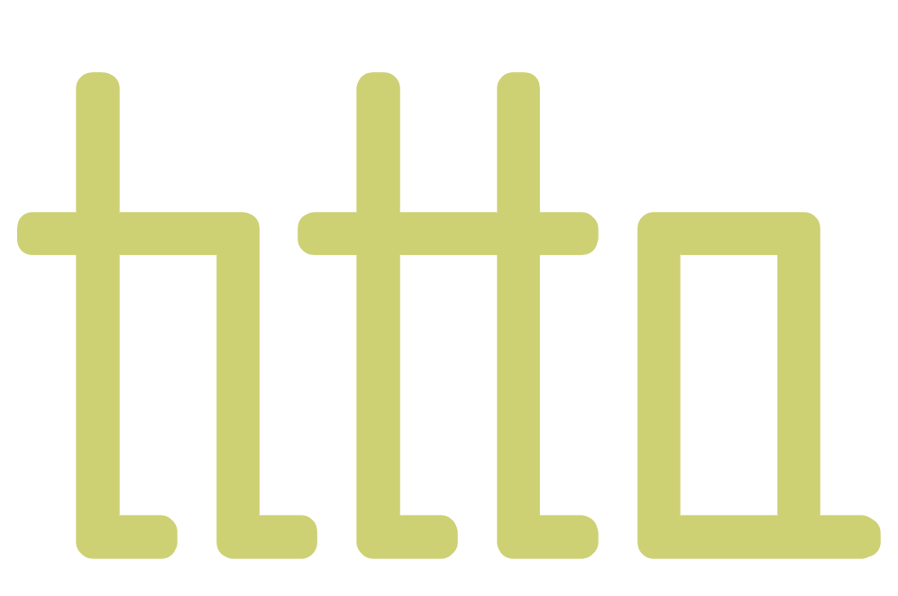

<p align="center">
    
</p>
  
<p align="center">
  <em>An alternative to ls built in Rust.</em>
</p>
  
<p align="center">
    
    
  
</p>
  
<p align="center">
  <a href="#install">Install</a> •
  <a href="#usage">Usage</a>
    <br>
  <a href="#deps">Dependencies</a> •
  <a href="#license">License</a>
</p>  
   

---
<div id="install"></div>

## Install
    
``` bash
cargo install titta
```
   
---
<div id="usage"></div>

## Usage
    
``` bash
$ ta <flags> <optional path>
```
  
### Flags
  
``` bash
-a : show hidden files
```
  
### Subcommands
  
``` bash
tree <level> : view as tree hierarchy
    example usage:
    $ ta tree 3 -a ~/Downloads/

help : view available flags, subcommands etc.
    example usage:
    $ ta help
```
   
### Config
  
Launch Titta for the first time to generate a default config file:  
`~/.config/titta/config`  
  
``` conf
# === colors ===

red = #DF6C74
green = #99C379
yellow = #F9E2B0
blue = #61AFEF
magenta = #C678DD
cyan = #87AFAE
orange = #DAA281
white = #AAB5C0
```
  
---
<div id="deps"></div>
  
## Dependencies
  
+ [terminal_size](https://github.com/eminence/terminal-size)  
+ [raster](https://github.com/kosinix/raster)  
+ [regex](https://github.com/rust-lang/regex)  
  
---
<div id="license"></div>

## License
This project is licensed under the [MIT License](https://github.com/simon-danielsson/titta/blob/main/LICENSE).  
